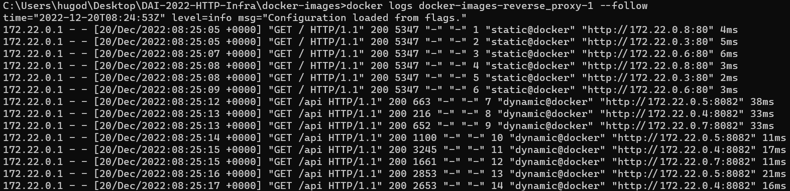

# DAI-2022-HTTP-Infra

## Introduction

Ce rapport est destiné au cours DAI de la HEIG-VD. Ce laboratoire avait pour but d'implémenter une infrastructure HTTP composée de deux services web (un statique et un dynamique) avec Docker. Pour ce faire, il fallait faire des `Dockerfile` et un `docker-compose` pour gérer l'ensemble de notre infrastructure d'un seul point d'entrée.

Il est aussi demander d'implémenter un reverse-proxy avec [Traefik](https://doc.traefik.io/traefik/).

## Step 1 : Serveur web statique

Cette partie met en service un serveur web statique avec apache httpd.

Pour illustrer cela, nous avons utilisé le template Bootstrap ["KnightOne"](https://bootstrapmade.com/knight-simple-one-page-bootstrap-template/).

Ce service écoute sur le port 80 (côté container).

### Dockerfile
```
FROM php:7.2-apache
EXPOSE 8081
COPY content/ /var/www/html/ # Copie le contenu du dossier content dans le dossier html du serveur web
```

### Apache config

La configuration apache se trouve dans le dossier `apache2` qui est accessible dans le container.
Pour y accéder il faut se connecter au container avec la commande `docker exec -it <container_name> bash` 
et ensuite aller dans le dossier `/etc/apache2`.

Etant donné que nous utilisons la configuration par défaut, nous n'avons pas créer de fichier de configuration localement qui serait copié dans le container.
Mais on aurait pu créer des fichiers de configuration localement et rajouter une ligne `COPY` dans `/etc/apache2` dans le Dockerfile pour changer la configuration du serveur si besoin.

## Step 2 : Serveur web dynamique

Cette partie met en service un serveur web `node.js` (v.18.12.1) avec le framework `express.js` qui génèrent aléatoirement
des données de factures à chaque requête GET sur la route `/api`.

Ce service écoute sur le port 8082 (côté container).

Construisez le container en local :
```bash
cd node-express-image
docker build -t hugoducom/node-invoices .
```

Lancez une instance du service :
```bash
docker run -p 8082:8082 hugoducom/node-invoices
```
_Ici le port 8082 en local a été choisi, il peut être changé. En revanche, ne pas changer le port 8082 du container, car celui-ci est défini dans `index.js`._

En faisait une requête GET sur `localhost/api` on obtient une liste de factures générées aléatoirement (cf. [exemple](figures/response_example.json)):

```json
[
  {
    "firstName":"Jordan",
    "lastName":"Vogel",
    "cardNumber":"5610695121575623",
    "productsSold":[
      {
        "productId":"107-96-0467",
        "productName":"kisfi",
        "quantity":7,
        "productUnitPrice":5328.26,
        "productTotalPrice":"37297.82"
      }
    ]
  },
  {
    "firstName":"Kate",
    "lastName":"Rovai",
    "cardNumber":"6304334605965006",
    "productsSold":[
      {
        "productId":"844-97-5832",
        "productName":"gemiwep",
        "quantity":8,
        "productUnitPrice":1783.01,
        "productTotalPrice":"14264.08"
      },
      {
        "productId":"952-29-7507",
        "productName":"feficotof",
        "quantity":10,
        "productUnitPrice":6042.76,
        "productTotalPrice":"60427.60"
      }
    ]
  }
]
```

### Dockerfile

```
FROM node:18.12.1
COPY ./src /opt/app
WORKDIR /opt/app
RUN npm install
EXPOSE 8082
CMD ["node", "/opt/app/index.js"]
```

La différence avec le Dockerfile statique réside dans le fait de définir le `WORKDIR` afin que la commande `npm install`, qui installe les dépendances, se fasse dans ce dossier.

L'option `CMD` permet de lancer le serveur avec node.

## Step 3a : Docker compose

Afin de lancer nos deux services paralèllement avec un seul point d'entrée, il faut créer un [`docker-compose`](docker-images/docker-compose.yml) à la racine du projet.

### docker-compose.yml

Nous créons donc deux services :
- static
- dynamic

```
version: "3"
services:
  static:
    image: hugoducom/httpd-static
    restart: unless-stopped
    ports:
      - "8081:80"
  dynamic:
    image: hugoducom/node-invoices
    restart: unless-stopped
    ports:
      - "8082:8082"
```

Le `restart: unless-stopped` est un ajout qui permet de démarrer le container automatiquement.

## Step 3b : Traefik reverse proxy

Il nous faut désormais configurer un reverse proxy à l'aide de Traefik.

Ce dernier va permettre de configurer les routes par lequelles seront accessibles les 2 services (static et dynamic).

Pour installer Traefik, il faut simplement suivre le [quick start](https://doc.traefik.io/traefik/getting-started/quick-start/) et modifier notre [docker-compose](./docker-images/docker-compose.yml) en rajoutant un service appelé `reverse_proxy`.

Pour rajouter les routes, il faut utiliser l'option `labels` avec une [rule de Traefik](https://doc.traefik.io/traefik/routing/providers/docker/#routers) dans chaque service :

```yml
# static service
depends_on:
  - reverse_proxy
labels:
  - "traefik.http.routers.static.rule=Host(`localhost`)"
# dynamic service
depends_on:
  - reverse_proxy
labels:
  - "traefik.http.routers.dynamic.rule=(Host(`localhost`) && PathPrefix(`/api`))"
```

_Note : `reverse_proxy` est le nom du service de Traefik._

Afin de construire nos 2 containers automatiquement, un script shell est disponible [build-images.sh](/docker-images/build-images.sh), à lancer avant de run `docker-compose up`.

Grâce à ces quelques lignes dans le docker-compose, on peut accéder aux 2 services via les routes suivantes :
- Static : `localhost`
- Dynamic : `localhost/api`

## Step 3c : Dynamic cluster management

Afin de créer plusieurs instances pour nos services, il faut modifier les ports des services dans le docker-compose et rajouter `--accesslog=true` à Traefik :

```
# reverse_proxy service
command: --api.insecure=true --providers.docker --accesslog=true
# static service
ports:
  - "80"
# dynamic service
ports:
  - "8082"
```

En effet, plusieurs instances ne peuvent pas écouter sur le même port, il faut donc simplement mettre le port côté container. Traefik s'occuper de tout pour le bind des ports.

Ensuite, il faut lancer notre `docker-compose up` avec quelques arguments :

```
docker-compose up --scale static=3 --scale dynamic=3
```

Ici, 3 instances du service static et dynamic seront générées.

Pour tester tout cela, après le docker compose up, on peut check les logs du service Traefik tout en rafraîchissant les deux services sur un navigateur (`docker logs docker-images-reverse_proxy-1 --follow`) :



On remarque que plusieurs IP sont appelées (donc plusieurs instances). On peut mettre émettre l'hypothèse que c'est du round-robin étant donné que les IP sont appelées dans le même ordre.

## Step 4 : AJAX requests with jQuery

Le but de cette étape est de rajouter des requêtes AJAX à notre service statique en modifiant le DOM de la page avec des données dynamiques provenant de notre service API.

Pour cela, nous allons utiliser l'API fetch de JavaScript. Il faut simplement rajouter un script (ici [fetch.js](docker-images/apache-php-image/content/fetch.js)) et le rajouter dans la page HTML de notre page statique : 

```javascript
function fetchOnePayment() {
    fetch("/api/").then(res => {
        return res.json();
    }).then(payment => {
        if (payment.length > 0)
            return payment[0].firstName + " " + payment[0].lastName + " card number : " + payment[0].cardNumber;
        else
            return "Personne ne doit payer aujourd'hui !"
    }).then(paymentToDisplay =>  {
        document.getElementsByClassName("payment")[0].textContent = paymentToDisplay;
    });
}

fetchOnePayment();
setInterval(fetchOnePayment, 2000);
```

Ainsi, dans notre page statique, toutes les 2 sec, le numéro de carte d'un client sera affiché ! (Attention, ceci n'est pas à faire dans un cas réel :D).

Voici le rendu final avec les requêtes Fetch sur la droite :


